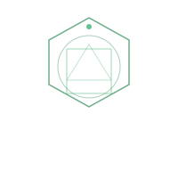
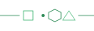

Currently leading high-performing teams across **Ringier SA** and **Ringier AG**. 
[Certified Integral Coach®](https://newventureswest.com) through **New Ventures West**, helping leaders & high performers navigate growth.

 

---

     

